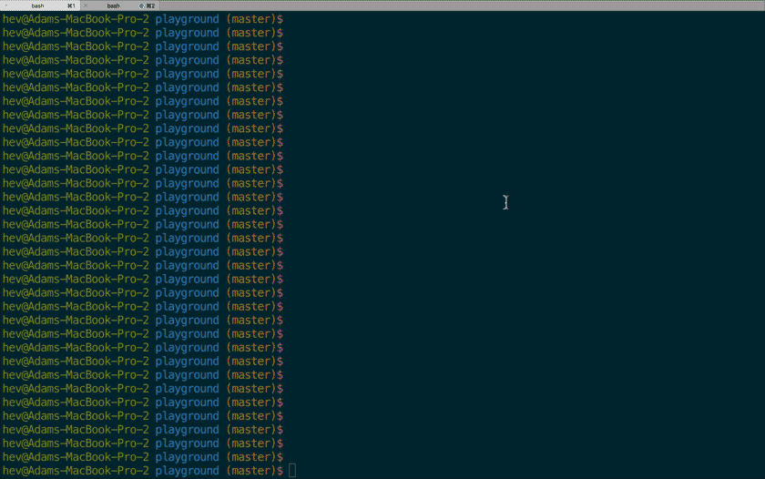

Log Cache CLI
=============

[![GoDoc][go-doc-badge]][go-doc] [![travis][travis-badge]][travis] [![slack.cloudfoundry.org][slack-badge]][loggregator-slack]

The Log Cache CLI can be installed and used in two ways.

 - Standalone CLI for Log Cache
 - Cloud Foundry CLI plugin for Log Cache

## Cloud Foundry CLI plugin

The Log Cache CLI Plugin is a [CF CLI](https://github.com/cloudfoundry/cli) plugin for the [Log
Cache](https://github.com/cloudfoundry/log-cache) system.



### Installing Plugin

The CF plugin is available in the CF-Community repo:
```
cf install-plugin -r CF-Community "log-cache"
```

Or, you can download a pre-built binary from GitHub:
```
# Linux
wget https://github.com/cloudfoundry/log-cache-cli/releases/latest/download/log-cache-cf-plugin-linux
cf install-plugin -f log-cache-cf-plugin-linux

# OSX
wget https://github.com/cloudfoundry/log-cache-cli/releases/latest/download/log-cache-cf-plugin-darwin
cf install-plugin -f log-cache-cf-plugin-darwin

# Windows
wget https://github.com/cloudfoundry/log-cache-cli/releases/latest/download/log-cache-cf-plugin-windows
cf install-plugin -f log-cache-cf-plugin-windows
```

Alternatively, you can build from source:
```
git clone git@github.com:cloudfoundry/log-cache-cli.git
cd log-cache-cli
scripts/install.sh
```

### Usage

```
$ cf tail --help
NAME:
   tail - Output logs for a source-id/app

USAGE:
   tail [options] <source-id/app>

ENVIRONMENT VARIABLES:
   LOG_CACHE_ADDR       Overrides the default location of log-cache.
   LOG_CACHE_SKIP_AUTH  Set to 'true' to disable CF authentication.

OPTIONS:
   --start-time               Start of query range in UNIX nanoseconds.
   --end-time                 End of query range in UNIX nanoseconds.
   --follow, -f               Output appended to stdout as logs are egressed.
   --lines, -n                Number of envelopes to return. Default is 10.
   --envelope-class, -c       Envelope class filter. Available filters: 'logs', 'metrics', and 'any'.
   --envelope-type, -t        Envelope type filter. Available filters: 'log', 'counter', 'gauge', 'timer', 'event', and 'any'.
   --json                     Output envelopes in JSON format.
   --name-filter              Filters metrics by name.
   --new-line                 Character used for new line substition, must be single unicode character. Default is '\n'.
```

```
$ cf log-meta --help
NAME:
   log-meta - Show all available meta information

USAGE:
   log-meta [options]

ENVIRONMENT VARIABLES:
   LOG_CACHE_ADDR       Overrides the default location of log-cache.
   LOG_CACHE_SKIP_AUTH  Set to 'true' to disable CF authentication.

OPTIONS:
   --guid              Display raw source GUIDs
   --noise             Fetch and display the rate of envelopes per minute for the last minute. WARNING: This is slow...
   --sort-by           Sort by specified column. Available: 'source-id', 'source', 'source-type', 'count', 'expired', 'cache-duration', and 'rate'.
   --source-type       Source type of information to show. Available: 'all', 'application', and 'platform'.
```

```
cf query --help
NAME:
   query - Issues a PromQL query against Log Cache

USAGE:
   query <promql-query> [options]

ENVIRONMENT VARIABLES:
   LOG_CACHE_ADDR       Overrides the default location of log-cache.
   LOG_CACHE_SKIP_AUTH  Set to 'true' to disable CF authentication.

OPTIONS:
   --end        End time for a range query. Cannont be used with --time. Can be a unix timestamp or RFC3339.
   --start      Start time for a range query. Cannont be used with --time. Can be a unix timestamp or RFC3339.
   --step       Step interval for a range query. Cannot be used with --time.
   --time       Effective time for query execution of an instant query. Cannont be used with --start, --end, or --step. Can be a unix timestamp or RFC3339.
```

Example `cf query` usage:

```
cf query "cpu{source_id='73467cc3-261a-472e-80e8-d6eadfd30d98'}" --start 1580231000 --end 1580231060 --step 1
```

## Stand alone CLI

### Installing CLI

You can download a pre-built binary from GitHub:
```
# Linux
wget https://github.com/cloudfoundry/log-cache-cli/releases/download/v2.1.0/log-cache-linux

# OSX
wget https://github.com/cloudfoundry/log-cache-cli/releases/download/v2.1.0/log-cache-darwin

# Windows
wget https://github.com/cloudfoundry/log-cache-cli/releases/download/v2.1.0/log-cache-windows
```

Alternatively, you can build from source:
```
git clone git@github.com:cloudfoundry/log-cache-cli.git
cd log-cache-cli
scripts/install.sh
```

### Usage

1. Target the Log Cache by setting the environment variable `LOG_CACHE_ADDR`.
1. Simply run the `log-cache` command to view current metrics stored in Log
   Cache.
1. Help can be accessed with the `--help` flag at any command level.

```
$ log-cache tail --help
Output logs and metrics for a given source-id

Usage:
  log-cache tail <source-id> [flags]

Flags:
  -f, --follow   Output appended to stdout as logs are egressed.
  -h, --help     help for tail
```

[log-cache]: https://code.cloudfoundry.org/log-cache-release
[cf-cli]: https://code.cloudfoundry.org/cli

[slack-badge]:              https://slack.cloudfoundry.org/badge.svg
[loggregator-slack]:        https://cloudfoundry.slack.com/archives/loggregator
[go-doc-badge]:             https://godoc.org/code.cloudfoundry.org/log-cache-cli?status.svg
[go-doc]:                   https://godoc.org/code.cloudfoundry.org/log-cache-cli
[travis-badge]:             https://travis-ci.org/cloudfoundry/log-cache-cli.svg?branch=master
[travis]:                   https://travis-ci.org/cloudfoundry/log-cache-cli?branch=master
